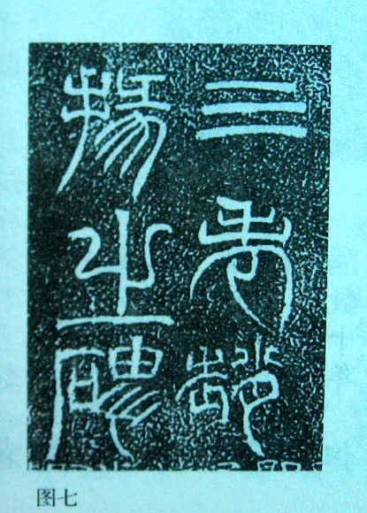

**2017年元月《大美墨言》书画展**

**重点讲解作品的资料收集与整理**

观众朋友，大家好！

欢迎您来到长沙博物馆参观，您现在所在的展厅是以“大美墨言”为主题的中国古代书画经典特展。共78幅精品，

湖南大学图像传媒所所长、武汉大学图像传媒技术研究中心首席专家王再教授带领科研团队，经过多年收集、整理与研究，与长沙市大丰文化传播有限公司共同合作，进行技术攻关，依托古代原画的图像数据，严格按照原作材质、比例，重现原作的原貌与神韵。这些古字画的真迹如今分散在世界各地，王教授的工作为中国古画的历史和艺术研究做出了重大贡献，也让我们能够在一个展厅里近距离的欣赏到这些足以乱真的复制件。

**北宋郭熙《早春图》**

纵: 158.3 厘米，横: 108.1厘米

郭熙(约1005\~1090)，是北宋末期杰出的山水画家。《早春图》是其代表作，乾隆皇帝曾这幅画题跋（写在字画前面的称题，写在后面的称跋）：“春山早见气如蒸”，其“三远法”（高远【近景细致、突出，高景巍峨、飘渺】、深远【等高处则体现透视、望远镜效果】、平远【有景深感、每一个层次都有细节有概括】）在中国山水画的发展史上有着深远的影响。他是一个非常有才华的画家，对绘画的悟性颇深，早期的画多是从自然中来，并没有具体的师承，后来受李成画风的影响，同时又兼学其他学派，最终自成体系，《林泉高致》是他对山水画的高度总结。比如《山水训》篇中说，学习画花的时候，将一株花植于深坑之中，从上面往下看，可以看到花的四个面。学习画竹的人，取来一枝竹，趁着夜色将它的影子照在白色的墙壁上，那么竹的形就在墙壁上显现出来了。学习画山水的人，又何尝不是如此呢?亲身到山川中去取景，山和水的的真意就可以感悟的到了。真实山水的岩石，远远地看就可以从远处观察得其气势，从近处观察的话，就可以得其形质。他画树枝采用的是李成的“鹿角枝”和“蟹爪枝”画法。画石皴法灵活多变被称之为“乱云皴**cūn**”

郭熙一生的艺术创作活动一般分为三个时期：

第一个时期是从出生到熙宁元年(1005’1068年)，而1068年就是郭熙艺术生涯的一个转折点，受到了丞相富弼的推荐，来修复大相国寺的壁画。

第二个时期是从熙宁元年到宋神宗去世的元丰末年(1068’1085年)，是郭熙创作的高峰时期。《早春图》，即创作于熙宁壬子年(1072年)。

第三个时期是从元丰末年到郭熙去世的哲宗元祜(1085’1094年)，是郭熙艺术创作的尾声。

**《伯远帖》**

王珣《伯远帖》，纸本，行书，共5 行47
字，纵25.1cm，横17.2cm，现藏于故宫博物院。是典型的“告哀问疾”手札，原文为：

珣顿首顿首，伯远胜业情期ji，群从之宝。自以羸患,
志在优游。始获此出，意不剋kè申。分别如昨，永为畴古。远隔岭领峤，不相瞻临。

翻译：珣顿首顿首，距伯远兄弟在事业正盛之时辞世已经一周年了，他生前深受众兄弟们的尊重，因为体弱多病，一直想悠游自在的生活，当初事业刚刚有起色，这样的事就发生了，没能达成愿望。和他的分别好像就在昨天，而他却永久的作了古人，远远地隔着山道，再也不来看我……

王珣，字元琳，琅琊(今山东)临沂人，生于东晋穆帝永和六年，卒于安帝隆安五年(350-401)，享年52岁。出身名门贵族，丞相王导之孙，中书令王洽长子。家族三世都以书法著称，他的叔叔王羲之，王羲之的第7子王献之被并称为“二王”。王珣的《伯远帖》是现存于世的唯一王氏书法墨迹真本。

魏晋时期的书论很少谈及技法问题，主要是因为当时的书法家对于自己的技法经验无比珍视，当做秘笈，不轻易授人。通过对比和文献研究，现在我们已经知道当时主流的执笔方式为“斜执笔”，就是用拇指、食指和中指三指执笔，与唐以后五指执笔相比，它灵活有余而纵向拉力不足。如贴中的“申”字最后一笔软弱无力，而“远”、“游”等却有很强的横向表现意味，为弥补竖线笔力不足，“以点代线”成为那个时代书法语言的特色，如“伯”。所以那个时期的书法以气取胜。

在乾隆帝得到王珣的《伯远帖》后，兴奋地将其与王羲之的《快雪时晴帖》、王献之的《中秋帖》集中藏在他养心殿的一间小书房里，认为它们属于“稀世神物，非寻常什袭可并云”，索性将这间小书房命名为“三希堂”。

最后，这篇《伯远帖》并不完整，中国当代著名书画家启功先生（雍正第9代孙，满人）指出“此贴尾已不全”，日本古村熹斋先生也说，一般王羲之的书信用纸横16cm，而此贴17.2cm，应该还有一页才对。

**檐道人梅花歌（金农“漆书”）**

清康熙二十六年，1687年，金农出生在浙江仁和钱塘江畔一个富裕家庭。金农初名司农，字寿田；三十九岁以后更名为农，字改为寿门，号冬心，取自崔国辅“寂寥抱冬心”。他的别号甚多，是“扬州八怪”中别号最多的一个。由于他在家族中排行26，所以多称他为“金二十六郎”。他以诗文成名，对金石碑版颇有研究，但仕途不顺，中年到处游历，虽然结交许多好友，但始终没有正当职业，晚年靠卖字画为生，虽然卖得很好，价格也挺高，但是经常入不敷出，妻子、小女先后离世，他还要到处借钱度日。七十岁，住进了扬州西方寺，经济困顿，亲友又相继辞世，他深感惆怅，于是遣散了童仆和哑妾，皈依佛门。乾隆二十九年，1764年秋，七十七岁的金农安然谢世。

“漆书”一词最早出现于唐代书法家张怀瓘**guàn**（一种古玉器，有注说是“圭”）的《书断》中：后汉社林“尝于西河得漆书《古文尚书》一卷，宝玩不已”。有传说，上古无笔墨，以竹梃（**tǐng，**杀猪后，在猪腿上划一个口子，用铁棍贴着腿皮往里捅，然后往里吹气，使猪皮绷紧，以便去毛）点漆，书竹（简）上，竹硬漆腻，画不能行，故头粗尾细，似其形耳。也就是说，用竹棍蘸漆写字，头粗尾细，像蝌蚪，被称为“漆书”。金农本人，以及他的好友们从没将他的作品称“漆书”，只是叫“八分书”，但是他爱用“倒薤xiè之笔”（汉魏三十六种篆体书法之一。传为殷汤时的隐士务光，于清冷坡种植薤为食，受风吹薤叶，交偃成文启发所得。），效果相似，100多年后的杨岘、徐康才将他的作品分到漆书一类中。

倒薤

金农另一种“楷隶”的书作，近代张宗祥称之为“切书”，因为他横画下笔时，以卧笔直切向下而后横行，像刀凿的痕迹。

**魏晋南北朝顾恺之《洛神赋图》**

《洛神赋图》是中国历史上有记载的第一幅卷轴画（绢本设色，与水墨画相对，意思是上了颜色的画）。作者顾恺之（公元346-407，东晋），字长康，小字虎头。晋陵郡（江苏无锡）人，出生于社会上层士族家庭，父亲顾悦之官至尚书右丞。他也是第一位在画上署名的画家。

顾恺之师承卫协，在线条运用、艺术构思和意境营造等方面造诣很高。他的作品注重表达人物的气质风度和内在性情。他和陆探微的画因为笔记周密，因此被认为是“密体”画风的代表，合称为“顾陆”，以区别于南朝张僧繇、唐代吴道子为代表的“疏体”。顾恺之、曹不兴、陆探微、张僧繇是当时影响最大的“六朝四大家”。顾恺之的绘画理论注重以形传神，他提出“四体妍媸chī（四肢形体的美与丑），本无关于妙处（是无关紧要的，是依托）；传神写照（画像如果要传神），正在阿堵中（关键就在眼睛中）。”
张彦远称，“象人之美，张得其肉，陆得其骨，顾得其神，神妙无方，以顾为最”。约364年，顾恺之在金陵（今南京）新落成的大瓦棺寺中绘制的“维摩诘”一直被视为画坛经典。就在即将绘制完成时，他请和尚将寺门打开接受众人参观，当众点上眼珠。病中（自称有病）“维摩诘”与人（文殊菩萨）讲经论道（《问疾》）的精神状态立马展现出来，神态之精准令人惊叹，在当时引起了轰动。

《洛神赋图》的原画已经失传，现存的至少有9卷，3卷藏于北京故宫博物院，台北故宫2卷，华盛顿佛利尔美术院2卷，伦敦大英博物馆1卷，目前看，与顾恺之最相似的是北京故宫博物院的宋代摹本（卷一）。它是一副叙事性强、情节线索明显、结构完整的绘画长卷，长572.8厘米。采用“散点透视”（与焦点透视【视觉真实】相对，体现心里真实）的手法，还原《洛神赋》中曹植与洛神故事，按相遇、嬉戏、离别的顺序安排了13处画面，人物52个，曹植出现了6次、洛神出现10次，其余为侍从和神女，另外还有马匹、神兽等。

《洛神赋》分为六段，“第一段写作者从洛阳回封地时，看到‘丽人’宓妃伫立山崖的
情景；第二段写‘宓妃’容仪服饰之美；第三段写‘余’非常爱慕洛神；第四段
写洛神为‘君王’之诚所感后的情状，第五段表达‘恨人神之道殊兮，怨盛年之
莫当’的感慨之情，是此赋的寄意之所在；第六段，抒写‘怅盘桓而不能去’，
表达别后‘余’对洛神的无限眷恋。”而《洛神赋图》分为三大场景，分别描绘了曹植与洛神相遇、洛神嬉戏并与曹植产生爱慕之情、人神殊途两分离的场面。

“相遇”曹植在洛川树林中信步游览，放眼望去，远方崖间洛水之上现一丽人，便是洛神。画面中美丽的洛神正回首看着曹植，四目相对，含情脉脉，这一场景中曹植一行人与洛神同处一个空间；画面继续向左延伸，呈现在观者眼前的依然是立于崖间的洛神形象，这时她正卷起衣袖，将洁白细腻的臂腕探到洛水之中，欲采摘湍急河水中的黑色灵芝；左侧斜上方不远处又出现了一个身边左有彩旗、右有桂枝，在山崖边缓步徘徊的洛神。

“离别”洛神离去，曹植引舟追赶，秉烛席地而夜不能寐，最后无奈只得与众人驾车离去。

《洛神赋图》也是工笔人物画，“惊若翩鸿，婉若游龙”是《洛神赋图》对《洛神赋》的完美诠释。图中的女主角——洛神，是伏羲的女儿，原名宓fú妃，住在洛水边，被河伯（冯夷）掳去成为夫妻，河伯长得很英俊，但是风流成性，所以夫妻关系不太好，回了洛水。河伯发脾气不好好管理黄河，导致洪水泛滥失去控制，玉帝罚他治水，河伯找到河图、宓妃找到洛书，两件神物合在一起使得河伯有能力操控上古神器——水玉，同时，河伯还找到大禹，联合他一起治水，最终洪水退去，宓妃也被封为洛神。

曹植《洛神赋》中洛神的原型是文昭甄**zhēn**皇后（183年1月26日－221年8月4日），她本是袁绍次子袁熙的妾，建安九年（公元204）年，冀州邺城被曹操攻破，宓妃被曹操带走。在庆功宴上，宓妃的美丽迷倒了曹操父子4人（还有曹彰），曹丕出于政治上的野心迎合父亲，爱而不露，曹植则真诚求爱，终得甄宓动情，赠以随身玉佩定情。不过最后，曹操还是将宓妃许给了曹丕。建安十九年（214年）曹植因为酗酒误事，发生了司马门事件，彻底被曹操放弃了。不久（217年），就立曹丕为太子。所以曹植与宓妃虽然两情相悦，但确是人神道疏。不过，我们这位大才子一直没有断了念想，两人一直有联系。公元220年，曹丕继位，他还是我行我素，直到第二年（黄初二年）曹丕杀掉了曹植的两个好朋友丁仪、丁廙**yì**，六月赐死宓妃，之后又因为喝酒误事（植醉酒悖慢，劫胁使者），被人举报弹劾，幸好有太后保着，贬为安乡侯。这些事件中间的联系耐人寻味。有学者研究众多史料后，发现弹劾曹植的事情不是一次两次，弹劾他的人也不止灌均一个，甚至有人拿出曹植与宓妃沟通交流的证据（玉镂金带枕）来弹劾他。只不过两人一直是精神上的互相欣赏，曹植还特意写了《洛神赋》来表达对宓妃的思念，所以，后来曹丕又后悔了，黄初三年，重新封曹植为鄄**juàn**城（山东省菏泽市）候，四月改为王。

**簪花仕女图（晚唐周昉**fǎng**）**

以宫廷贵族仕女现实生活为主题，描绘的是暮春季节，一群浓妆艳福的妇女在幽静而空旷的庭院里，过着嬉游的奢靡生活。以小狗、白鹤、蝴蝶为伍消磨时间。从右往左读，第一位体态丰硕，发髻高大，头上插着牡丹花（4-5月），髻前饰玉簪步摇（走动就会摇晃的头饰），那珍珠流苏似在不停摇晃。脸庞圆润，有淡薄的红晕，瓜子形画眉，右手执绋**fú**子（乱丝）逗狗。

第二位，披白衫，发髻上插着红花，漫不经心地举起右手，好像是要掀开领子取凉，左手伸出好像也在召唤小狗。

第三位，是一位执长柄扇的侍女。

第四位，发髻上插荷花（6-9月），右手拈着一朵红花，正在凝视遐思。

第五位，是一位身材娇小，头上插着海棠花（4-5月）的妇女，头饰、衣着极为华丽，超出众人，好像从远处走来。

第六位，发髻上插着芍药花（5-6月），上身微微前倾，右手提起披帛（薄薄的罗纱裁成，上面印有花或者金银线织成的图案。唐时的帛巾有两种，一种布幅较宽，长度较短，多为已婚妇女所用，披在肩上；另一种布幅窄而长度可达2米，多为未婚女子所用。），迎接想她跑来的小狗。

左侧是一株辛夷花（3-4月）。

这幅画的背景是在安史之乱以后，当时的统治阶级为了粉饰太平，提倡所谓的“文治”，在一定程度上符合当时人民经历战乱，渴望安宁的愿望，所以宴游的风气抬头，晚唐贞元年间（唐德宗李适）更是如此。周昉本是宫廷画家，擅长人物。这幅画展现了当时人们的审美观。胖胖的脸颊、袒胸裸臂、披纱、斜领大袖、大幅长裙、高高的发髻、凝脂般的肌肤、双娥一样的短眉、樱桃般的朱唇、玉簪步摇、眉间还有金色的花钿diàn（以金、银制成花形，蔽于脸上，形状除梅花状外，还有各式小鸟、小鱼、小鸭等）。

画中人物的等级也十分鲜明，服饰发髻就不说了，非常明显，鞋子，贵妇穿的是高头履，侍女穿的是软底鞋。

画中女性性感的一面，肌肤的刻画是一方面，服饰中也有讲究，诃**hē**子，是唐代女性胸衣的名称，以暴露为特色，而且“薄且透”，以彩丝及金缕交织出花纹图案，这种方式称为“织成”，入手感觉比较厚实。

**明皇幸蜀图**

唐代画家、绘画理论家张彦远，在他的《历代名画记》中说：“山水之变，始于吴（道子），成于二李”，这二李就是唐朝画家李思训、李昭道父子。李思训本是皇家宗室，20岁就少年得志，可惜碰上武则天执政，为了躲避武则天的杀害，丢官隐居，直到武则天死。之后任左羽林大将军，封彭国公。所以后人尊称他“大李将军”。他的画重视写实，他的儿子李昭道也是在朝为官，官至太子中舍，擅长金碧山水、鸟兽、楼台、人物等，画风工巧精致，虽是豆人寸马，也须眉毕现。《明皇幸蜀图》的作者便是李昭道，主题是唐玄宗为躲避安史之乱到成都避难途中（四川省广元市剑门山附近）的某个场景。这个时候，李思训已经去世了。值得一提的是，李思训的弟弟李思诲的儿子李林甫正是唐玄宗宠信了19年的腐败宰相。所以李家的青绿山水画也成为中唐时期的一大特色。

据史料记载，安禄山兴兵作乱的时候，咸阳、金城等地的百姓和大小官员跑得比皇帝还快，所以唐玄宗所到之处，没有官吏接驾，也看不到什么百姓，带的金银珠宝换不来半点粮食。队伍凌乱不堪，人人无精打采，为了安定军心，唐玄宗不惜杀御马充饥。中途，太子李亨，大将陈玄礼、太监李辅国等策划了“马嵬wéi驿兵变”（今陕西兴平市西北二十三里）杀掉了杨国忠，逼死了杨贵妃。之后，李亨带着部队向北收拾残兵旧部，唐玄宗带着家眷侍从继续向成都逃难。

在这样的背景下，唐玄宗可以说是心力憔悴，外，国难当头，内，家门不幸，画家为了回避皇帝的难看，又要记录这段历史，便设计了皇帝在春天于山岭间旅行的画面。用青绿色强调“春”的气息，但是山岭险峻、栈道迂回陡峭，既体现出蜀道之难，又隐喻面对磨难时，内心的煎熬；画中人物的安排也煞费苦心，中间较显眼的是一群侍从，明皇、嫔妃和侍臣在右下角，这样一来，这幅画就明显不是用于歌颂皇帝的了。元代有一部鉴别古画真迹的奇书名为《古今画鉴》，其中对历代画作的评论文章集中在《画史清裁》中，里面对《明皇幸蜀图》有一段描述，众人骑马从飞仙岭栈道出来，终于见着平路，连马都感到惊奇，明皇所骑的三花马（御用，通灵的骏马，因其马鬃梳作三辫得名）看见小桥，徘徊着不敢前进。可见旅途之疲劳，逃难之狼狈。

最后，在画上还有清代乾隆皇帝提的几行诗。“青绿关山迥，崎岖道路长。客人各结束，行李自周祥。总为名和利，哪辞劳和忙。年陈失姓氏，北宋近乎唐。甲午新秋御题”乾隆也觉得皇帝跑路有失体面，所以，把这群人描述成一群商人，而且连时间都篡改了。天子一言九鼎，以至于，20世纪以前都被人当做宋代的《关山行旅图》。

**千里江山图（**纵 51.5 厘米，横 1191.5 厘米，近12米**）**

作者是北宋时期的宫廷画家王希孟在十八岁时完成的一副长卷，画卷最左端有宰相蔡京的一段跋文：“政和三年闰四月一日赐。希孟年十八岁，昔在画学为生徒，召入禁中文书库，数以画献，未甚工，上知其性可教，遂诲谕之，亲授其法。不逾半载乃以此图进，上嘉之，因以赐臣。京（蔡京本人）谓天下士在作之而已。”从文字中可以知道，王希孟画画基础很扎实，十几岁就成为宫廷画家，他工作勤奋刻苦，经常能看到他进献的作品，但是都不能展现出他精细的画工，宋徽宗赵佶看到他的潜力，亲自教他，不出半年就画出了这副《千里江山图》，皇帝非常喜欢，还赐给了蔡京。可惜的是这位天才少年只留下这样一幅作品，二十几岁就死了。

北宋初期，山水画主要以郭熙的水墨山水为主，对墨色（干、湿、浓、淡、焦）的运用可以看出作者对意境的掌控能力。构图上依据其三远法。但是宋哲宗以后青绿山水受到统治阶层的青睐，这幅《千里江山图》就是典型代表。

他用石青色表示山，赭石色表示石、土坡阴面露出的本色，石绿色表示阳光下的平野和有草覆盖的山，花青色表示有云的阴影遮盖的山。整幅画面江山连绵不断，间或出现奇峰幽谷，点缀有村舍寺观、长桥巨舫，疏林丛竹、芦荻茂草，小景精细入微，大景气势磅礴。体现出我祖国河山灿烂辉煌的美。

**清高宗大阅图**

乾隆二十二年（1757年），新疆回部白山派首领霍集占兄弟发动叛乱，史称大小和卓叛乱。第二年初，乾隆便发兵征讨，遭遇顽强抵抗，苦战数月，直到10月，布鲁特族愿意归顺大清，战局开始一边倒。大阅礼是顺治帝定下的阅兵制度，每三年在南苑举行一次，不过乾隆只是在登基后的第四年举行过一次。为了配合平回战役，趁着布鲁特、哈萨克等使臣到来之际彰显大国风范，以示军容，乾隆决定举行第二次大阅礼。时间定于十一月初五，而这幅图绘于十月十四日，赶在大阅之前挂在南苑新衙门行宫。

作者郎世宁是一位意大利人，在中国生活了51年，历经康熙、雍正、乾隆三朝，他保持了欧洲绘画注重人物解剖结构的长处，同时又适当吸取了传统中国“写真”技艺的表现手法。这幅《清高宗大阅图》中，乾隆金盔绣甲，佩戴刀箭，骑着花色骏马，英姿勃发，君临天下。体现乾隆帝不忘“骑射”、“勤兵务政”的尚武精神。

**山鹧棘雀图**

北宋初期，沿袭五代后蜀南唐的旧制，建立翰林图画院，大批原五代的宫廷画家继续为皇家服务，其中就有这幅画的作者黄居寀**cǎi**，他是名画家黄筌quán季子，受家族熏陶和培养，重视观察和写生，从图中的山鹧搭配山麻雀就可以看出来，普通麻雀喜欢与人类做邻居，脸上多有黑斑，而山麻雀喜欢在山林中，这些鸟儿或飞翔、或栖枝、或觅食，或鸣叫，整幅画将山水画与花鸟画完美结合，色彩艳丽，极富自然情趣，又有远离尘世喧嚣的寓意。

**五牛图**

《五牛图》是现存最古的纸本中国画，共描绘了五头形态各异的牛。

画中的五头牛姿态各异，
它们有的低头吃草，有的抬头仰望、快步前行，有的站定不动、张嘴叫唤，有的扭头舔舌，有的穿鼻环、戴缨络，神情庄重，闷头走路。韩滉以简洁的线条勾勒出牛的骨骼，将牛不同形态的正、侧面都表现出来，每一头既独立成图，
又首尾相连， 彼此顾盼，具有极大的视觉欣赏价值。

这幅画原本没有名字，是后来流入南宋内府，由宋徽宗在画上写了“唐韩滉五牛图真迹，
宣和殿御题”之后，才有了《五牛图》的名称。

五牛图上的印章和题跋非常多，说明它被很多人收藏过。按时间顺序来看，最早是被南宋内府收藏，然后元代有赵伯昂、赵孟頫fǔ（宋太祖赵匡胤十一世孙，著名书法家、画家、诗人，创“赵体”书，与欧阳询、颜真卿、柳公权并称“楷书四大家”）、元仁宗太子、唐古台、邹君玉；明代有项元汴**biàn**、顾从德、顾复等；清朝有金农，然后就入了清宫被乾隆收藏，直到1900年被八国联军劫掠到海外，1952年周恩来亲自批示从香港以6万港币购回，保存在故宫博物院。1976年开始对齐进行修复。故宫古书画修复专家沈洪彩跟随她的师父——“南裱”大师孙承枝花了2年多的时间才修复好这幅画，当时仅这五头牛身上就有55个洞，边口裂缝120个。

作者韩滉（huàng）（723年－787年3月19日）出生显贵，父亲韩休官至宰相，自己也是一路官运亨通。建中四年（783年，唐德宗李适（kuò）的第一个年号），泾原兵变，叛军攻陷长安，唐德宗出逃奉天。韩滉时任镇海军节度使，驻守江苏省长江以南，他封锁关口、修筑石头城，加强防守，帮助德宗皇帝渡长江，兴元元年（784年，唐德宗第二个年号）派遣弓弩手数千人解除宁陵之围，还为友军运送粮草，提供后勤保障，为平乱、收复长安立下大功。贞元元年（785年，唐德宗第三个年号）封郑国公，贞元二年封晋国公，贞元三年逝世，享年65岁。

据研究，这幅《五牛图》创作于贞元元年。乾隆皇帝在画上的题跋中提到弘景，也就是有着“山中宰相”之称的南朝文学家、炼丹家陶弘景。他是江苏南京人，辞官后隐居茅山，梁武帝多次请他入朝为官，他都不同意，还画了两头牛送给梁武帝，一头用金笼头牵着，另一头自由自在的吃草。表明了他隐居的决心，梁武帝不仅没有生气，还常常与他通信，甚至亲自与他讨论政事，于是就有了“山中宰相”的称号。这个典故对后人的影响很大，到北宋，宋真宗时期，也出了一位隐居华山的高士仲放，他效仿陶弘景，在家中看人家画牛来拒绝宋真宗的邀请。有了这些先例，以画来含蓄的同君王交流，表达自己的政见可能是韩滉创作这幅《五牛图》的直接动力。贞元元年时，韩滉因为平乱有功，连连晋升，不仅拥有重兵，雄踞长江下游，而且还完全控制了长江南北的粮帛运输，在官场混迹多年的经验告诉韩滉，自己距离皇帝猜忌已经不远了，于是这幅《五牛图》就在这样的背景下被创作出来了，一方面耕牛在当时是国家农业生产的有利工具，不能宰杀，另一方面，牛勤劳老实憨厚，任劳任怨，也不忍杀。相信唐德宗也能理解韩滉的忠诚。不久，韩滉就被召回封为晋国公，明是升职，实则削权。

《五牛图》是在乾隆十七年（1752年）41岁时，作为祝寿贡品进入清宫的，当时乾隆并不在意，第二年才开始喜欢这幅画，因为五牛图符合他农业治国的政治思想。我们可以看到在画心处有乾隆提的诗“一牛络首四牛闲，宏景高情想像间。舐龅讵惟夸曲肖，要因问喘识民艰。”后面的落款，写的是葵酉（1753年）。

之后，不久，他的词臣蒋溥**pǔ**见乾隆喜欢《五牛图》，就先后两次把自己父亲蒋廷锡收藏的和明代画家项元汴**biàn**的摹本献给了乾隆。乾隆非常高兴，将它们和真迹一起放在丰泽园的一处斋室，命名为“春藕斋”。他从乾隆十七年开始，连续23年在丰泽园演耕礼，树立重视农耕的形象。然后在春藕斋休息，欣赏《五牛图》。

有学者提出故宫的这幅《五牛图》不是真迹，理由有四：

1、画面上没有宋徽宗那有名的瘦金体题跋

2、赵孟頫的题跋，前后相差21年，却写在同一张纸上，不合逻辑，后面题跋的人没必要专门为他留空白。

3、赵孟頫题跋中，提到在元太子府第二次看到这幅画时，出现了对太子不敬的语言“此图业旧藏，不知何时归太子房”，意思是原本是他收藏的，后来被盗，不知怎么就出现在太子这里了。

4、有其他文章提到，乾隆所提的字为“真迹无疑”，而不是“兴讬春犁”。

正因为不是真迹，所以乾隆舍得在画心题跋。

**《雪景山水图》**南宋 梁楷

纵111.3厘米，横49.7厘米，绢本，水墨浅设色，现藏日本东京国立博物馆。这是一幅无论构图还是笔墨都极具时代特点却又极具个性魅力的经典之作。北宋后期，一些画家已开始尝试另辟蹊径，如李唐，将北宋风尚的密点皴和卷云皴简化为一笔横扫、意蕴万象的斧劈皴，迫使后来者将北宋崇尚“高远”法的全景山水画简化为近景细致、远景隐约的“深远”法的“一角”（马远）、“半边”（夏圭）山水画。形成南宋山水画的新风尚。而梁楷则发挥极致，《雪景山水画》的构图极其简括：图下画一水岸，右边岸坡画三株大树，一直两偃，枝桠枯槎，左边雪色苍茫的山谷中两人骑马而行；图上是雪山，左边前后两座山岗，顶上枝杈密布，后面山峦向右上高耸，唯余茫茫一片。山只画半边，画面上大片的空白，只有山岗顶上的树丛与岸畔的大树相呼应，构图极其简练，却寒气逼人。
